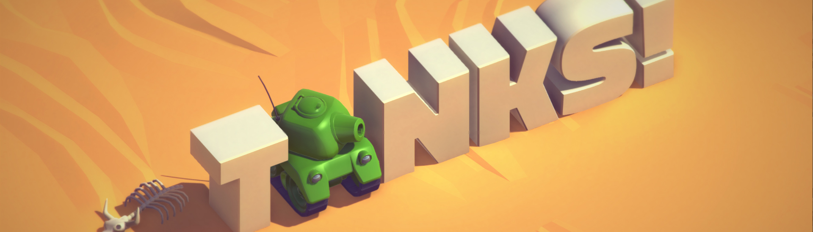

# tanks-game

https://acuteangel.github.io/tanks-game/

Controls:

Blue Player: Arrow keys to move, Enter to shoot

Red Player: WASD to move, Space to shoot

Hold down shoot to charge up. Shells are automatically fired at max charge. Shells arc and can go over enemies and obstacles. Shells have splash damage and can friendly-fire.

Have fun :)

Disclaimer: this game is created from the Unity tutorial at https://unity3d.com/learn/tutorials/s/tanks-tutorial

I only followed the tutorial, this is simply here to show what I have learned.